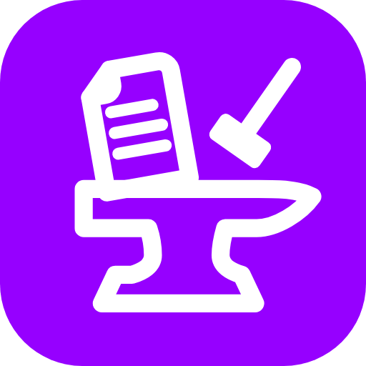
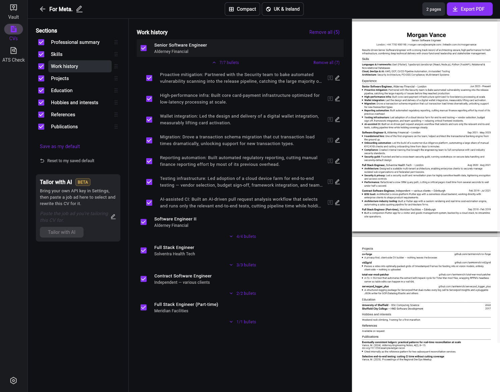
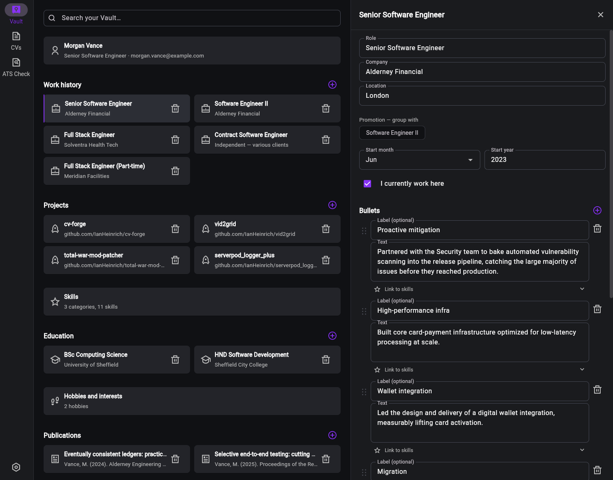
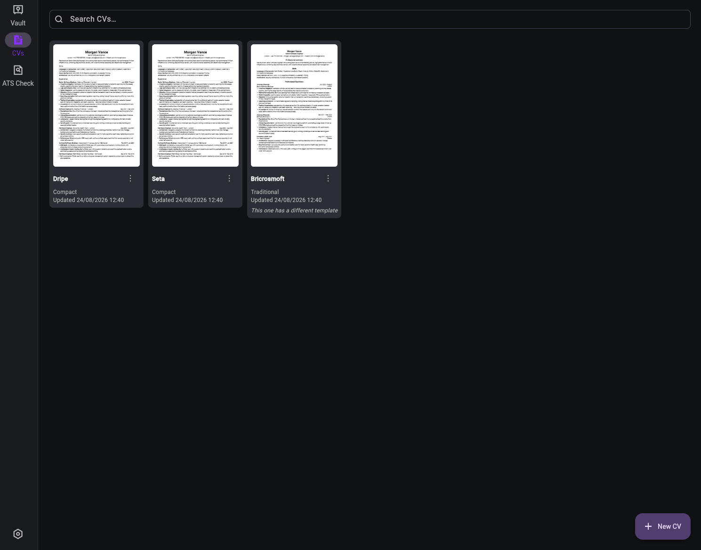
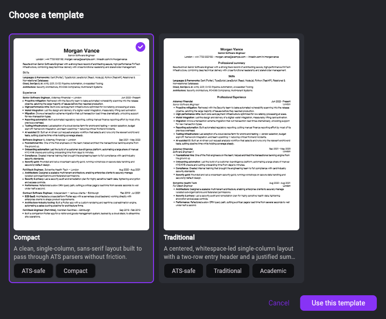
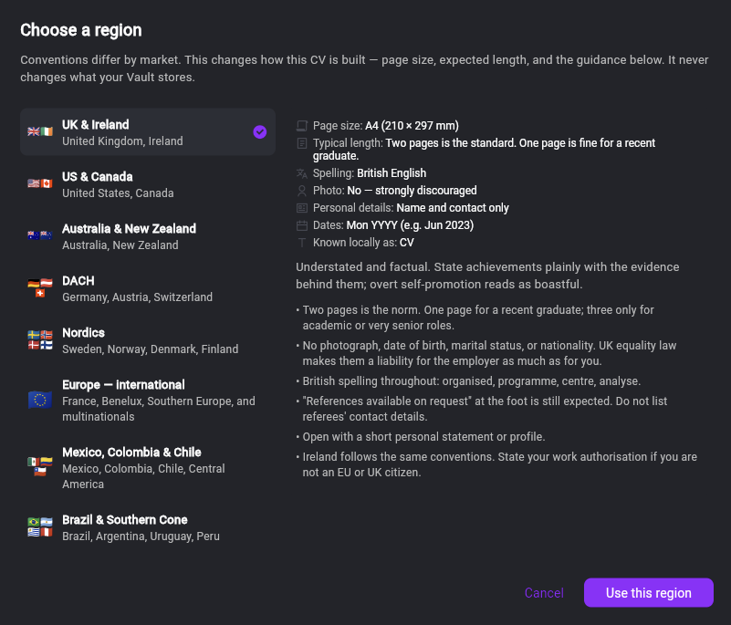
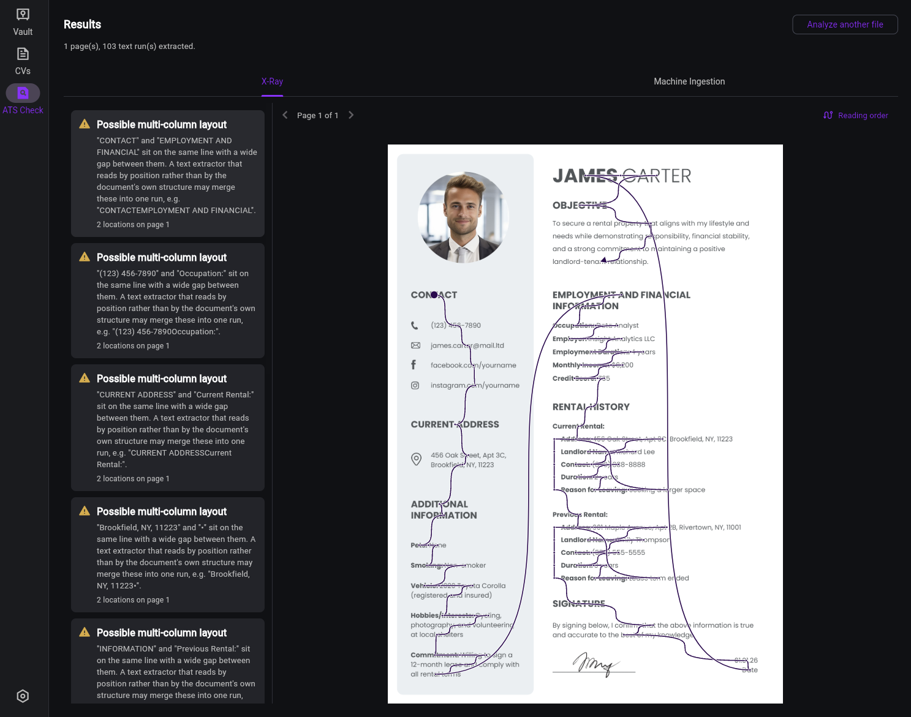

<div align="center">



# CVForge

**Tailor a CV to every application without losing your history.**

A client-side, privacy-first CV builder for the web. No backend, no account,
no tracking. Everything you type stays in your browser.

[](https://github.com/IanHeinrich/CVForge/actions/workflows/ci.yml)
[](https://github.com/IanHeinrich/CVForge/actions/workflows/deploy.yml)
[](LICENSE)
[](https://flutter.dev)

**[Open the app](https://ianheinrich.github.io/CVForge/)**

[Features](#features) · [Getting started](#getting-started) ·
[Architecture](#architecture) · [Contributing](CONTRIBUTING.md)



</div>

## The idea

Most CV tools give you one CV and let you edit it into the ground. Every time
you tailor it for a role, you lose something you might have wanted next time.

CVForge splits that into two jobs.

The **Vault** is your master record. Every role, project, bullet point, skill,
publication and qualification you've ever had, whether or not it belongs on
any particular CV. It's never the thing you send.

The **Studio** is where you build one CV for one application by picking from
the Vault. Toggle sections, choose which bullets make the cut, reorder them,
and watch a real PDF update as you go.

Delete a bullet from a CV and it's still in your Vault. Build twenty CVs off
one history without copy-pasting between documents.

## Features

### Vault

Work history with per-role bullets, projects, skills grouped into categories,
education, publications, references and hobbies. Bullets can be linked to
skills, so picking a skill for a CV can pull in the evidence behind it.

### Studio

Pick sections and individual bullets, reorder them, and preview the result as
a real PDF (that's the screenshot at the top). The preview is the export:
Studio rasterises the same bytes that `Export PDF` writes, so what you see
can't drift from what you send.

Every CV you build lands in a grid with its first page rendered, so you can
tell twenty near-identical CVs apart at a glance.

|  |  |
| :--: | :--: |
|  |  |
| The Vault, with an entry open | The CVs you've built so far |

### Output that survives a resume parser

Exports are vector PDFs with selectable, copyable text, not a picture of a CV.
Two templates ship today. Both are single-column on purpose, since
multi-column layouts are what most often confuse a parser.

| Template | Shape |
|---|---|
| **Compact** | Clean, single-column, sans-serif. Built to pass through ATS parsers without friction. |
| **Traditional** | Centred and whitespace-led, with a two-row entry header and a justified summary. |

CV conventions also aren't universal, so you pick a region and CVForge adjusts
page size, expected length, date format, what the document is even called, and
the guidance it shows you. Eight regions ship: UK & Ireland, US & Canada,
Australia & New Zealand, DACH, Nordics, Europe (international),
Mexico/Colombia/Chile, and Brazil & Southern Cone.

|  |  |
| :--: | :--: |
|  |  |
| Templates, previewed against your own CV | Region conventions |

### ATS Check

Upload any existing CV, not only one CVForge made, and see what a resume
parser sees. X-Ray flags the format problems that make extractors misread a
document. The main offender is a multi-column layout, where two columns
sharing a baseline get merged into one nonsense line. Reading order traces the
path a position-sorting extractor actually takes through the page.

<div align="center">

</div>

### Optional extras, all off by default

- **Tailor with AI** (beta). Paste a job ad and have a model select and rewrite
  bullets for it. Bring your own API key; Anthropic and Google Gemini are
  supported. Stays off until you add one.
- **Google Drive sync.** Mirrors your Vault and CVs to your Drive's hidden app
  folder, so a second browser picks up where you left off. Stays off until you
  sign in.
- **JSON backup.** Export everything to a file and import it back.

## Privacy

By default CVForge makes no network calls with your data at all. There's no
server component to this project. Your Vault and CVs live in your browser's
IndexedDB, and PDF generation happens on-device.

That cuts both ways, so it's worth being blunt: your data is only as durable
as your browser's site storage. Clearing site data, or working in a private
window, will lose it. Turn on Drive sync or take a JSON backup if that matters
to you.

Two optional features change the picture, and only if you turn them on.

| Feature | What leaves your browser | Where it goes |
|---|---|---|
| **Tailor with AI** | The job ad, plus your CV's career content: experience, projects, skills, education | Straight to Anthropic or Google, using *your* API key |
| **Google Drive sync** | Your Vault and CVs, as the same JSON the backup export produces | Your own Google Drive, hidden app folder |

Neither routes through a CVForge server, because there still isn't one.

For AI tailoring specifically, your identifying details (name, email, phone,
location and profile links) are stripped before the request is built and are
never part of it. The feature shows you exactly what's about to be sent,
before it sends it.

## Getting started

You'll need [Flutter](https://docs.flutter.dev/get-started/install) 3.47.0,
which is what CI pins, though newer stable releases will usually work.

```bash
git clone https://github.com/IanHeinrich/CVForge.git
cd CVForge
flutter pub get
flutter run -d chrome
```

That's the whole setup. There are no environment variables, no services to
stand up and no API keys. The app runs fully featured without them, minus the
two optional integrations above.

To build a release:

```bash
flutter build web --release
```

Deploying under a sub-path, as GitHub Pages does, needs the base href:

```bash
flutter build web --release --base-href /CVForge/
```

## Architecture

Flutter Web, [Stacked](https://stacked.filledstacks.com/) MVVM, with
[freezed](https://pub.dev/packages/freezed) for immutable models.

Four things are worth knowing before you read the code.

**It's organised by feature, not by layer.** Views, dialogs and
feature-specific widgets live together under `lib/features/<feature>/`. Only
genuinely shared things stay global: services, common widgets, routing and DI.
Stacked's routing and locator are centralised by design, so splitting those up
isn't on the table.

**Models never import Flutter.** `lib/models/` is pure Dart.
`render/cv_composer.dart` is the only place Vault data and Draft selections get
joined into the `ResolvedCv` a template renders.

**There's one renderer, not two.** A template owns exactly one `pdf`-package
renderer. Studio's live preview rasterises that same PDF instead of keeping a
parallel Flutter widget tree alive, so preview and export can't disagree on
content or on pixels.

**Pagination is already solved, and it's a trap.** Splitting a CV across pages
is harder than it looks in `package:pdf`. `templates/design/section_pagination_pdf.dart`
is the one place it's done correctly, and new templates have to route through
it. [CONTRIBUTING.md](CONTRIBUTING.md) explains why before you write one.

```
lib/
├── app/            # Stacked wiring: routes, locator (generated)
├── features/       # Vertical slices
│   ├── analyzer/   #   ATS Check
│   ├── settings/
│   ├── studio/     #   Building one CV
│   └── vault/      #   The master record
├── models/         # Pure Dart, freezed. No Flutter, no pdf.
│   ├── draft/      #   What a CV selects from the Vault
│   ├── render/     #   Vault + Draft -> ResolvedCv
│   └── vault/      #   The master record's shape
├── services/       # Always global, even single-consumer ones
├── templates/      # One pdf renderer per template, plus design tokens
└── ui/             # Shared chrome: theme, tokens, common widgets
```

## Development

[CONTRIBUTING.md](CONTRIBUTING.md) has the full conventions and the reasoning
behind them. The short version:

```bash
stacked generate                  # freezed, json_serializable, locator, router
dart format .                     # always, immediately after generating
flutter analyze
flutter test --exclude-tags=golden
```

> [!NOTE]
> Golden tests are baselined on Linux, so they show small pixel diffs on macOS
> or Windows even when nothing has really changed. `--exclude-tags=golden` is
> the signal that's actually green locally. CI verifies them properly on every
> PR.

## Deployment

Pushing to `main` runs [`deploy.yml`](.github/workflows/deploy.yml). It looks
for a version bump in `pubspec.yaml`, builds with `--base-href /CVForge/`,
publishes to GitHub Pages and tags the release. No bump means no deploy.

`404.html` handles deep links. GitHub Pages has no rewrite rules, so it encodes
the requested path into a query string and `index.html` restores it before the
router reads the URL.

## Contributing

Issues and pull requests are welcome.
[CONTRIBUTING.md](CONTRIBUTING.md) covers setup, the conventions this codebase
enforces, and what CI checks.

One rule is worth stating up front: scaffold with the Stacked CLI rather than
by hand. Hand-written views, services and widgets miss the route and DI wiring
the CLI maintains, and drift from the generated conventions.

## License

[Apache License 2.0](LICENSE), Copyright 2026 Ian Heinrich.

## Acknowledgements

Built with [Stacked](https://stacked.filledstacks.com/),
[freezed](https://pub.dev/packages/freezed),
[pdf and printing](https://github.com/DavBfr/dart_pdf),
[Hive CE](https://pub.dev/packages/hive_ce) and
[Remix Icon](https://remixicon.com/). Deep-link handling on GitHub Pages
follows [spa-github-pages](https://github.com/rafgraph/spa-github-pages).
